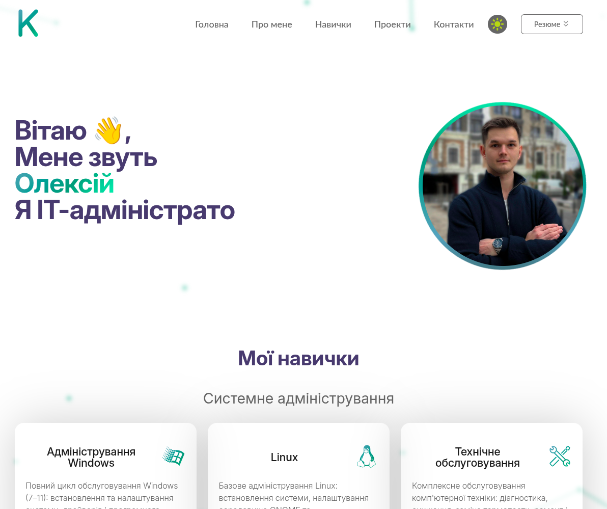
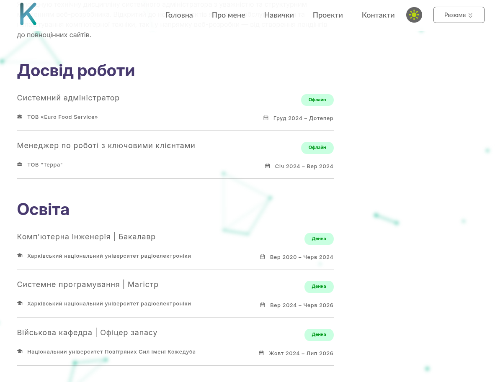
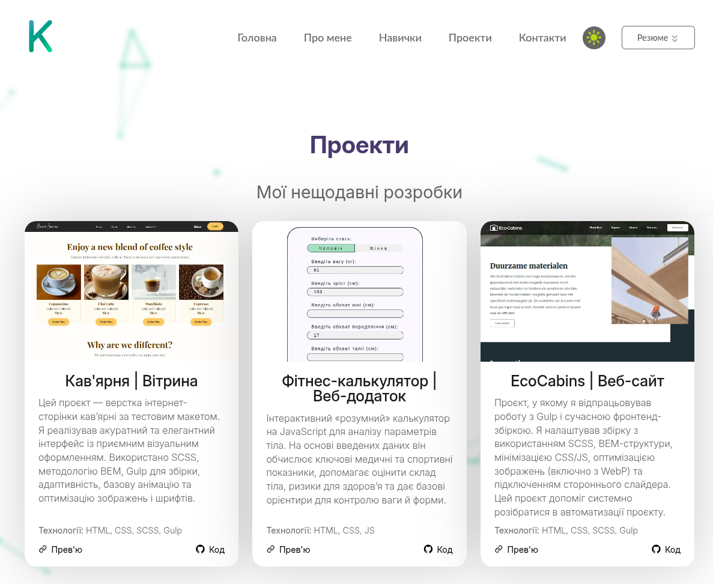
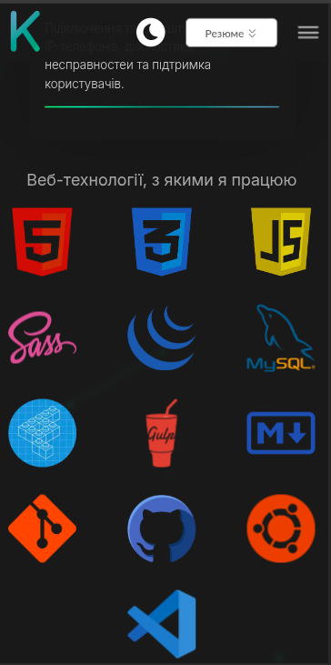
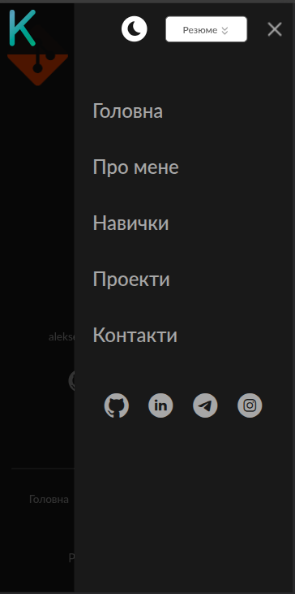

# KolomWorks — Personal Portfolio Website

  
  
  
  
  

---

Личный сайт-портфолио, разработанный полностью с нуля с использованием **HTML, SCSS и JavaScript**.

Проект создавался как долгосрочная платформа для презентации профессиональных навыков, опыта работы, образования и реализованных проектов. В отличие от классического лендинга, сайт изначально проектировался как полноценное многостраничное приложение с возможностью дальнейшего масштабирования, внедрения новых технологий и расширения функциональности.

Основная цель проекта — не только представить меня как Frontend-разработчика, но и продемонстрировать практический подход к разработке современных веб-приложений, внимание к деталям, качеству кода, архитектуре проекта и оптимизации производительности.

---

# 🚀 Основные возможности

- 🌐 Многостраничная архитектура
- 🌍 Поддержка трёх языков (Русский / Українська / English)
- 🌙 Светлая и тёмная темы оформления
- 📱 Полностью адаптивный интерфейс
- ⚡ Оптимизация производительности
- 🎨 Интерактивный анимированный фон
- ✨ Анимации появления элементов
- 🪟 Собственная система модальных окон
- 🔍 SEO-оптимизация
- 📦 Модульная архитектура проекта

---

# 🛠 Используемые технологии

### Основные

- HTML5
- SCSS (Sass)
- JavaScript (ES6+)
- Gulp
- PHP
- MySQL
- Git
- GitHub

### Методологии и инструменты

- BEM
- Markdown

> По мере развития проекта список используемых технологий будет расширяться.

---

# 📷 Скриншоты проекта

### Desktop

  

  

  

---

### Mobile

  
  

---

# 📖 О проекте

Цель данного проекта — самостоятельно разработать собственный сайт-портфолио, который позволяет презентовать себя как специалиста, продемонстрировать профессиональные навыки, опыт работы, образование и реализованные проекты.

Сайт задумывался не как разовый учебный проект, а как долгосрочная платформа, которую можно постепенно развивать, расширять новым функционалом и использовать для демонстрации практических навыков Frontend-разработки.

Во время разработки особое внимание уделялось архитектуре проекта, повторному использованию компонентов, производительности, качеству пользовательского интерфейса и современным подходам к организации кода.

Ниже подробно описаны основные возможности и технические решения, реализованные в процессе разработки проекта.

---

# ⚙ Реализованные возможности

## 1. Многостраничная структура сайта

Проект реализован как полноценное многостраничное приложение.

В состав сайта входят следующие основные страницы:

- Home
- About
- Projects
- Tech Stack
- Contacts

Такой подход обеспечивает удобную навигацию, логичную структуру проекта и возможность дальнейшего масштабирования без изменения общей архитектуры.

---

## 2. Мультиязычность сайта

На сайте реализована полноценная поддержка нескольких языков с собственной системой переключения локализации.

Поддерживаются три языка:

- ua Украинский
- en Английский
- ru Русский

Логика переключения языков реализована самостоятельно без использования сторонних библиотек.

---

## 3. Поддержка светлой и тёмной темы

На сайте реализована возможность переключения между светлой и тёмной темами оформления.

Особенности реализации:

- плавная смена темы без перезагрузки страницы;
- корректное изменение цветов всех элементов интерфейса;
- адаптация текста, кнопок, изображений, карточек и фоновых элементов;
- единый стиль оформления для обеих тем.

---

## 4. Интерактивный фон

Для оформления сайта реализован интерактивный анимированный фон с использованием системы «живых частиц».

Фон располагается за основным контентом и дополняется эффектом размытия (Glassmorphism), благодаря чему интерфейс выглядит современно и остаётся удобным для чтения.

---

## 5. Начальная анимация приветствия

При первом открытии сайта пользователь видит приветственную анимацию.

Она обеспечивает плавную загрузку интерфейса и создаёт более приятное первое впечатление при посещении сайта.

Кроме визуального эффекта, данный экран скрывает процесс первоначальной инициализации некоторых элементов страницы.

---

## 6. Анимация при прокрутке страницы

Практически все основные блоки сайта имеют собственные анимации появления.

Анимации запускаются автоматически при попадании элемента в область просмотра пользователя.

Такой подход делает взаимодействие с сайтом более живым и улучшает восприятие интерфейса.

---

## 7. Модальные окна (Pop-up)

На сайте реализована собственная система модальных окон.

Поддерживаются:

- открытие модального окна;
- закрытие различными способами;
- обработка пользовательских действий;
- блокировка прокрутки страницы;
- корректная работа на мобильных устройствах.

---

## 8. Работа с внешним API

Для реализации интерактивного фонового эффекта подключён внешний API.

В процессе разработки были выполнены:

- настройка параметров библиотеки;
- адаптация конфигурации под дизайн сайта;
- оптимизация производительности;
- интеграция с общей архитектурой проекта.

---

## 9. Оптимизация шрифтов

При работе со шрифтами особое внимание было уделено скорости загрузки сайта и кроссбраузерной совместимости.

В процессе разработки были реализованы следующие решения:

### Конвертация форматов

Все используемые шрифты были конвертированы в современные форматы **WOFF2** и **WOFF**, что позволило значительно уменьшить их размер без потери качества.

При загрузке сайта браузер автоматически использует наиболее оптимальный поддерживаемый формат.

### Минимизация количества файлов

На сайте используется всего два семейства шрифтов:

- первое содержит одно начертание;
- второе — четыре начертания.

Всего проект загружает **5 файлов шрифтов**, что положительно влияет на скорость отображения текста.

### Иконочный шрифт

Все SVG-иконки были объединены в единый иконочный шрифт.

Такое решение позволило:

- уменьшить количество HTTP-запросов;
- упростить использование иконок;
- обеспечить масштабирование без потери качества;
- сохранить единый стиль отображения на всех устройствах.

---

## 10. Оптимизация изображений

Для уменьшения объёма передаваемых данных и ускорения загрузки сайта была проведена комплексная оптимизация всех графических ресурсов.

### Оптимизация изображений

Все изображения были предварительно сжаты без заметной потери качества.

Это позволило значительно уменьшить общий размер проекта и сократить время загрузки страниц.

### Использование WebP

Все изображения форматов **PNG** и **JPEG** были конвертированы в современный формат **WebP**.

Если браузер пользователя не поддерживает WebP, автоматически используются исходные изображения, что обеспечивает корректную работу сайта на любых устройствах.

---

## 11. HTML

При разработке HTML-структуры проекта основное внимание уделялось читаемости кода, повторному использованию компонентов и дальнейшей поддержке проекта.

### Модульная структура

HTML-код разбит на отдельные независимые блоки.

Такой подход позволяет:

- повторно использовать одинаковые элементы;
- избежать дублирования кода;
- значительно упростить поддержку проекта.

### Версионирование ресурсов

Подключение CSS- и JavaScript-файлов реализовано с использованием механизма версионирования.

Благодаря этому после обновления проекта браузер автоматически загружает новые версии файлов вместо использования устаревшего кэша.

### Семантическая вёрстка

При разработке структуры страниц использовались семантически корректные HTML-теги.

Это позволило:

- улучшить читаемость кода;
- повысить доступность сайта;
- улучшить индексацию страниц поисковыми системами.

---

## 12. SCSS

Все стили проекта были разработаны с использованием препроцессора **SCSS**.

Структура проекта изначально проектировалась таким образом, чтобы максимально упростить масштабирование и поддержку кода.

### Модульная архитектура

SCSS-код разделён на независимые логические блоки.

Каждый компонент располагается в собственном файле, благодаря чему структура проекта остаётся понятной даже при дальнейшем росте количества страниц.

### Возможности SCSS

Во время разработки активно использовались возможности препроцессора:

- переменные;
- миксины;
- циклы;
- собственные функции;
- вложенность.

Это позволило уменьшить количество повторяющегося кода и сделать стили значительно более удобными для поддержки.

### Минификация

После компиляции весь CSS автоматически минифицируется для уменьшения размера итоговых файлов.

### Группировка Media-запросов

Все Media-запросы автоматически объединяются во время сборки проекта.

Это делает итоговый CSS более компактным и значительно улучшает читаемость исходного SCSS-кода.

### Автоматические префиксы

Во время сборки автоматически добавляются необходимые CSS-префиксы для обеспечения корректной работы современных браузеров.

---

## 13. SEO-оптимизация

При разработке проекта были реализованы базовые механизмы поисковой оптимизации сайта.

### Meta-теги

Для каждой страницы настроены собственные:

- Title;
- Description;
- Keywords.

Это позволяет поисковым системам корректно определять содержимое каждой страницы.

### Open Graph и Twitter Cards

Добавлены специальные Meta-теги для корректного отображения сайта при публикации ссылок в социальных сетях.

Поддерживаются:

- Open Graph;
- Twitter Cards.

### Sitemap и Robots

Для поисковых систем были созданы:

- sitemap.xml;
- robots.txt.

Это позволяет поисковым роботам быстрее индексировать страницы сайта и понимать его структуру.

### Schema.org

Добавлена структурированная микроразметка **Schema.org**, содержащая основную информацию о владельце сайта.

Это позволяет поисковым системам получать дополнительные сведения о проекте и улучшает качество индексации.

### Семантическая HTML-разметка

Для повышения качества SEO также используется семантическая структура HTML-документов, что положительно влияет на восприятие страниц поисковыми системами.

---

## 14. Обработка контактной формы

Для сайта реализована полноценная клиент-серверная обработка формы обратной связи с использованием **PHP** и **MySQL**.

1. После заполнения формы выполняется валидация данных на стороне клиента (JavaScript), а затем повторная проверка на стороне сервера (PHP).

2. После успешной проверки сообщение автоматически сохраняется в базе данных **MySQL**.

3. После сохранения данных автоматически формируется и отправляется уведомление на электронную почту администратора сайта.

### Используемые технологии

- JavaScript
- PHP
- MySQL
- SMTP

# Заключение

Данный проект является моим личным сайтом-портфолио и одновременно долгосрочным учебным проектом.

При его разработке основной целью было не просто создать красивый сайт, а реализовать максимально качественную архитектуру проекта, уделяя внимание структуре кода, оптимизации, производительности, SEO, адаптивности и удобству дальнейшей поддержки.

Проект регулярно развивается и дополняется новыми возможностями. По мере изучения новых технологий и подходов в веб-разработке я продолжаю улучшать существующую архитектуру, оптимизировать кодовую базу и расширять функциональность сайта.

Именно поэтому данный репозиторий отражает не только итоговый результат, но и мой профессиональный рост как Frontend-разработчика.

---

⭐ Если вам понравился проект, буду рад, если вы поставите ему звезду на GitHub.
